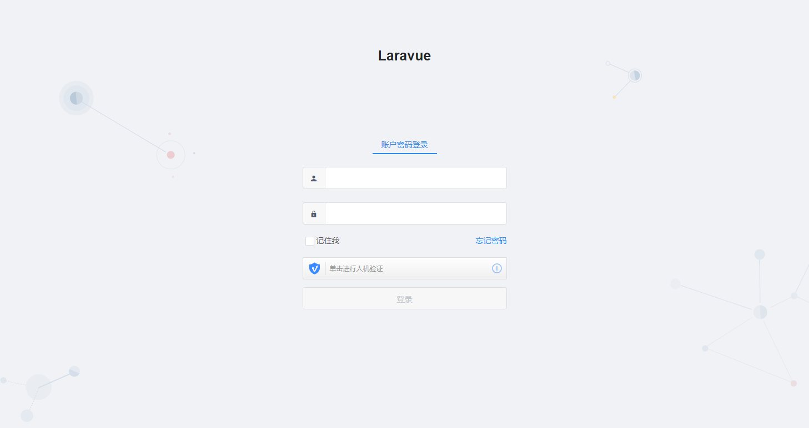

# laravue

[](https://github.com/leslieeilsel/laravue-next/issues)





#### 安装扩展

```bash
# 克隆项目
git clone https://github.com/leslieeilsel/laravue.git

# 安装composer依赖
cd Laravue
composer install

# 推荐使用yarn安装扩展包
cnpm install
```
#### 配置

```bash
# 复制配置文件
cp .env.example .env

# 生成加密key
php artisan key:generate

# 生成jwt加密key
php artisan jwt:secret

# 配置env中的数据库链接
配置数据库名称、用户名和密码

# 数据库迁移
php artisan migrate
php artisan db:seed

# 将database/data/laravue.sql导入数据库
```

#### 编译运行

```bash
# 开发环境编译
npm run dev、npm run watch(监控文件修改)
# 生产环境编译，压缩JS文件
npm run prod
```
